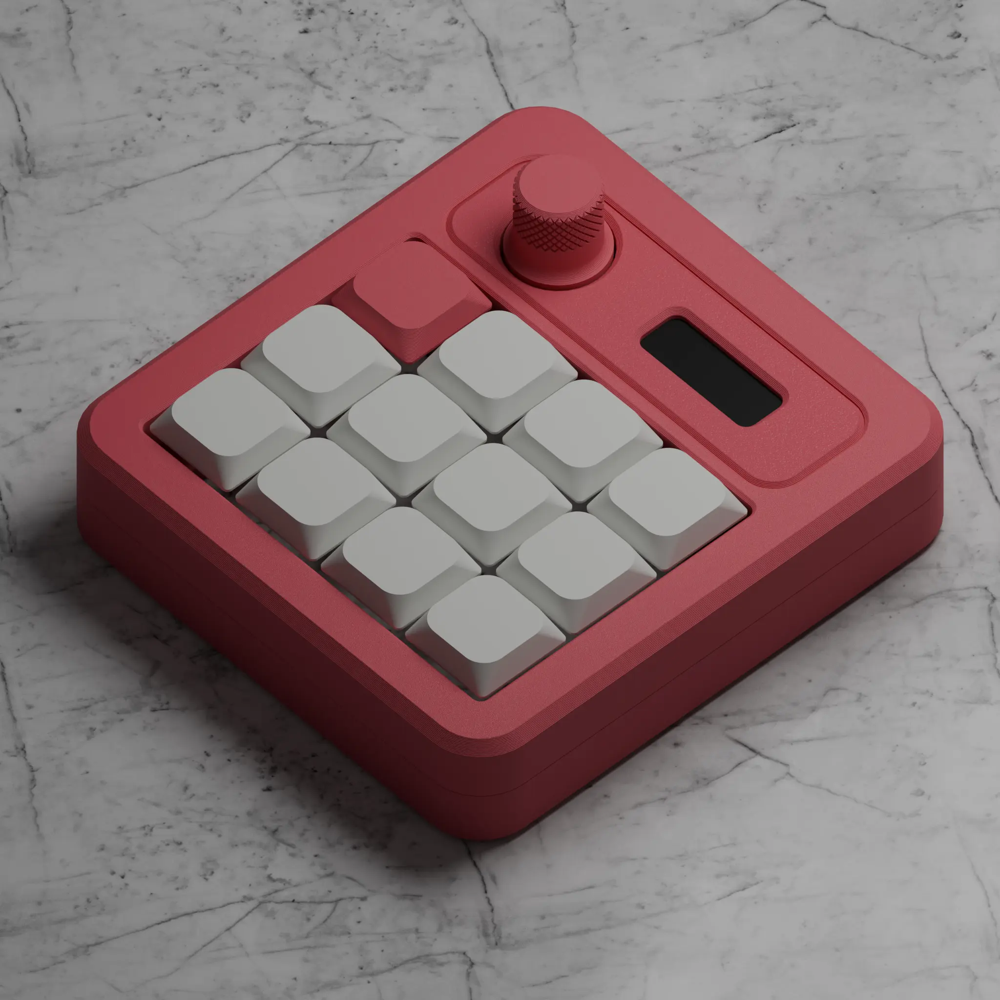

import { LinkCard, CardGrid } from '@astrojs/starlight/components';

## Links
 

<CardGrid>
  <LinkCard 
    title="
<s>Interest Check</s>
" 
    href="" 
  />
  <LinkCard 
    title="
<s>Color Configurator</s>
" 
    href="" 
  />
</CardGrid>

---

:::caution
**THIS IS A 3D PRINTED PRODUCT.**  
**THERE ARE MAYBE SOME MINOR IMPERFECTIONS ON THE SURFACE.**
:::

## 1\. Specifications

- Top and Bottom case (3D Printed PLA)
- Top cover (3D Printed PLA)
- Keycaps (3D Printed PLA)
- Knob (3D Printed PLA)
- FR4 Plate
- Sandwich mount
- 3x4 keys
- Rotary encoder with push button
- 0.91' OLED screen

---

## 2\. Colorways

_Based on interest check._

---

## 3\. Design

### 3.1 Structure

The macropad will be using sandwich mount.

### 3.2 Case

### 3.3 Stand

There will be two options for the stand. The stand will be available in 14 0r 40 degree. The stand is magnetic and can be interchangeable.

---

## 4\. PCB

- 1.6mm thickness
- USB-C
- MX hot-swap
- RP2040 MCU
- ESD protection
- Per-key RGB

:::note
The PCB components will come pre soldered except for encoder and OLED pin header,
which will be manually soldered by me.
:::

---

## 5\. Firmware

The device will come with QMK-based firmware with two options. VIA or Vial support.  
Both firmware will be release on Github.

---

## 6\. Contents Included in Each Kit

The sets will come with all the things you need except switches.

| Parts                 | Notes                       |
| --------------------- | --------------------------- |
| Case (Top and Bottom) | 3D-printed PLA              |
| Top Cover             | 3D-printed PLA              |
| Stand                 | 14° or 40° (3D-printed PLA) |
| Keycaps               | 14x (3D-printed PLA)        |
| Knob                  | 1x (3D-printed PLA)         |
| Plate                 | FR4                         |
| PCB                   | 1.6mm thickness             |
| Rotary Encoder        | 1x                          |
| OLED screen           | 1x                          |
| Screw                 | 6x                          |
| Rubber feet           | 4x                          |

---

## 7\. Pricing

_Soon._

---

## 8\. Group Buy

_Soon._

---

## 9\. Other

### 9.1 NexaHub Companion App

currently have no plans for a formal release. However, if there is enough interest, I am open to releasing it 'as-is' with limited support. Please note that it has only been tested on my personal system; if anyone is interested in beta testing later, your help would be greatly appreciated.